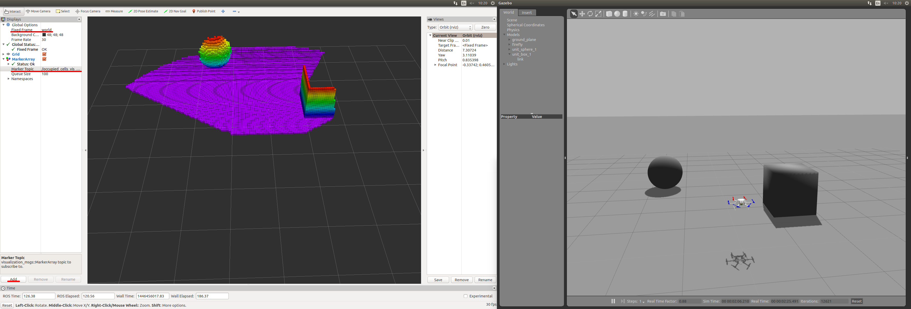

# OctoMap

官网英文原文地址：http://dev.px4.io/simulation-gazebo-octomap.html

[OctoMap库](http://octomap.github.io/)实现了一个三维占据栅格地图的方法。本文介绍如何在[RotorS仿真](https://github.com/ethz-asl/rotors_simulator/wiki/RotorS-Simulator)中使用它。

## 安装

需要预先安装ROS，Gazebo和Rotors Simulator插件，按照Rotors Simulator中的[指南](https://github.com/ethz-asl/rotors_simulator)安装这些。

接着，安装OctoMap库
<div class="host-code"></div>

```sh
	sudo apt-get install ros-indigo-octomap ros-indigo-octomap-mapping
	rosdep install octomap_mapping
	rosmake octomap_mapping
```

现在，打开`~/catkin_ws/src/rotors_simulator/rotors_gazebo/CMakeLists.txt`并在文件底部添加下面内容：
<div class="host-code"></div>

```sh
	find_package(octomap REQUIRED)
	include_directories(${OCTOMAP_INCLUDE_DIRS})
	link_libraries(${OCTOMAP_LIBRARIES})
```

打开`~/catkin_ws/src/rotors_simulator/rotors_gazebo/package.xml`添加下面内容：
<div class="host-code"></div>

```sh
	<build_depend>octomap</build_depend>
	<run_depend>octomap</run_depend>
```

执行下面两行

> 提示:第一行是将默认的shell编辑器（vim）修改为gedit。推荐不熟悉vim的用户使用，如果熟悉的话，可以忽略。

```sh
	export EDITOR='gedit'
	rosed octomap_server octomap_tracking_server.launch
```

将下面两行

```sh
	<param name="frame_id" type="string" value="map" />	
	...
	<!--remap from="cloud_in" to="/rgbdslam/batch_clouds" /-->
```

修改为

```sh
	<param name="frame_id" type="string" value="world" />	
	...
	<remap from="cloud_in" to="/firefly/vi_sensor/camera_depth/depth/points" />
```

## 运行仿真


现在，在三个不同的终端窗口中执行下面三行。这将打开Gazebo，Rviz和octomap服务器。


```sh
	roslaunch rotors_gazebo mav_hovering_example_with_vi_sensor.launch  mav_name:=firefly
	rviz
	roslaunch octomap_server octomap_tracking_server.launch
```

在Rviz窗口的左上方，修改域`Fixed Frame`，将`map`改为`world`，然后在窗口左下方单击add按钮并选择MarkerArray，最后双击MarkerArray，并将`Marker Topic`从`/free_cells_vis_array`修改为`/occupied_cells_vis_array`。

现在，你应该看到地面的一部分。

在Gazebo窗口的红色旋翼飞行器前方插入一个立方体，此时你应该可以在Rviz中看到它。



