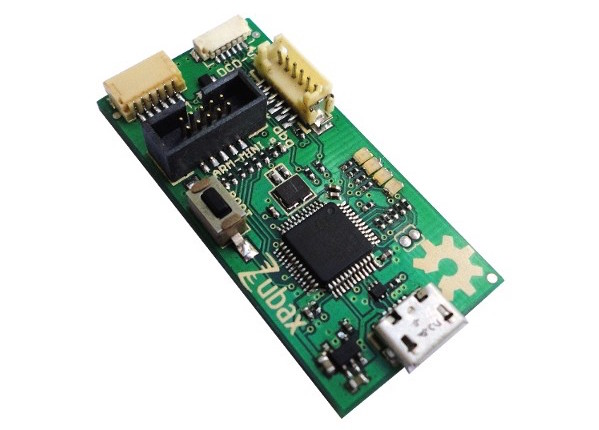
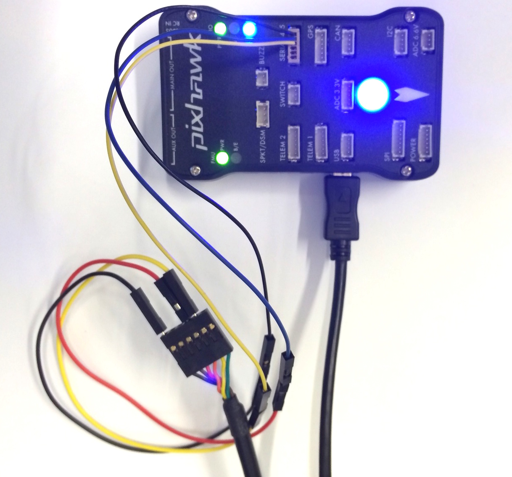

# PX4系统控制台

官网英文原文地址：http://dev.px4.io/advanced-system-console.html

该系统控制台（System Console）允许访问系统底层，调试输出和分析系统启动流程。访问系统控制台最方便的方式是使用[Dronecode 探针](http://nicadrone.com/index.php?id_product=65&controller=product)，但是也可以使用FTDI线。

## 系统控制台（System Console） vs. Shell

有多种shell，但只有一个控制台：系统控制台，它是打印所有引导输出（和引导中自动启动的应用程序）的位置。

- 系统控制台（第一shell）：硬件串口
- 其他shells: 连接到USB的Pixhawk(如Mac OS显示为 /dev/tty.usbmodem1)

<aside class="tip">
USB: To just run a few quick commands or test an application connecting to the USB shell is sufficient. To use it, boot the system without the microSD card inserted. The hardware serial console is only needed for boot debugging or when USB should be used for MAVLink to connect a 
如果只是运行几个简单的命令或测试应用程序，连接到USB shell是足够的。要使用USB shell，需要在不插入microSD卡的情况下引导系统。只有在需要开机调试或USB用于MAVlink连接地面站[GCS](../3_Tutorial/ground_control_station.md).的时候，才需要硬件串行控制台。
</aside>

## Snapdragon Flight: Console接线

开发人员工具包里面有一个三个引脚接口板，它可以用于访问控制台。将捆绑的FTDI电缆连接到标头，并将接口板连接到扩展连接器。

## Pixracer / Pixhawk v3: Console接线

将6PJST SH 1：1线缆连接到Dronecode Probe，或者将连接线的每个接头按照如下所示连接到FTDI线上：

| Pixracer / Pixhawk v3 |           | FTDI |                  |
| --------------------- | --------- | ---- | ---------------- |
| 1                     | +5V (red) |      | N/C              |
| 2                     | UART7 Tx  | 5    | FTDI RX (黄) |
| 3                     | UART7 Rx  | 4    | FTDI TX (橙) |
| 4                     | SWDIO     |      | N/C              |
| 5                     | SWCLK     |      | N/C              |
| 6                     | GND       | 1    | FTDI GND (黑) |

## Pixhawk v1: Console接线

系统控制台可以通过Dronecode Probe或FTDI线访问。这两个选项将在下面解释。

### 使用Dronecode Probe连接

将 [Dronecode probe](http://nicadrone.com/index.php?id_product=65&controller=product) 的6P DF13 1:1线连接到Pixhawk的SERIAL4/5接口。



### 通过FTDI 3.3V 线连接

如果手头没有Dronecode Probe，也可以使用FTDI 3.3V (Digi-Key: [768-1015-ND](http://www.digikey.com/product-detail/en/TTL-232R-3V3/768-1015-ND/1836393)) 。

| Pixhawk 1/2 |           | FTDI |                  |
| ----------- | --------- | ---- | ---------------- |
| 1           | +5V (红) |      | N/C              |
| 2           | S4 Tx     |      | N/C              |
| 3           | S4 Rx     |      | N/C              |
| 4           | S5 Tx     | 5    | FTDI RX (黄) |
| 5           | S5 Rx     | 4    | FTDI TX (橙) |
| 6           | GND       | 1    | FTDI GND (黑) |

连接器引脚接线如图下图。


完整的布线如下。



## 打开控制台

After the console connection is wired up, use the default serial port tool of your choice or the defaults described below:
控制台连接接线后，使用您选择的工具的默认串口或者以下描述的默认设置：
### Linux / Mac OS: Screen

Ubuntu下安装screen (Mac OS 已经默认安装了):

<div class="host-code"></div>

```bash
sudo apt-get install screen
```

- 串行: Pixhawk v1 / Pixracer 使用 57600 波特率
- 串行: Snapdragon Flight 使用 115200 波特率

使用 screen 连接到正确的串口，配置为 BAUDRATE baud, 8 data bits, 1 stop bit (使用 `ls /dev/tty*` and 观看在拔下/重新插入USB设备时，发生了什么样的变化). 常见名称，Linux下是`/dev/ttyUSB0` and `/dev/ttyACM0` ，Mac OS下是 `/dev/tty.usbserial-ABCBD`。

<div class="host-code"></div>

```bash
screen /dev/ttyXXX BAUDRATE 8N1
```

### Windows: PuTTY

下载 [PuTTY](http://www.chiark.greenend.org.uk/~sgtatham/putty/download.html) 并启动它.

然后选择“串行连接”，然后设置端口参数：

- 57600 baud
- 8 data bits
- 1 stop bit

## 控制台（Console）入门

键入ls查看本地文件系统，使用free查看剩余的可用RAM。当控制板单独供电时，控制台也将显示在系统引导日志。

```bash
nsh> ls
nsh> free
```
## MAVLink Shell
 For NuttX-based systems (Pixhawk, Pixracer, ...), the nsh console can also be
 accessed via mavlink. This works via serial link or WiFi (UDP/TCP). Make sure
 that QGC is not running, then start the shell with e.g.
  (use `-h` to get a description of all
 available arguments).
对于基于NuttX的系统（Pixhawk，Pixracer，...），NSH控制台也可以通过mavlink访问。它通过串行链路或WiFi（UDP / TCP）来工作。确保QGC没有运行，然后启动shell使用如下命令`./Tools/mavlink_shell.py /dev/ttyACM0`（使用-h获得所有可用参数的描述）。
 
# Snapdragon DSP Console

当您通过USB连接到您的Snapdragon板，你可以访问POSIX上PX4的shell 。与DSP侧（QuRT）的交互可以通过`qshell`POSIX应用程序及其QuRT伴随电脑伴侣来开启。

With the Snapdragon connected via USB, open the  to see the output of the DSP:
通过USB连接的Snapdragon，打开mini-dm可以看到DSP的输出：
```
${HEXAGON_SDK_ROOT}/tools/mini-dm/Linux_Debug/mini-dm
```

运行主程序：

```
cd /home/linaro
./mainapp mainapp.config
```

您现在可以从linaro的shell以下语法来使用DSP加载的所有的应用程序：

```
pxh> qshell command [args ...]
```

例如，要查看可用的QuRT应用程序：

```
pxh> qshell list_tasks
```

所执行的命令的输出显示在minidm。
