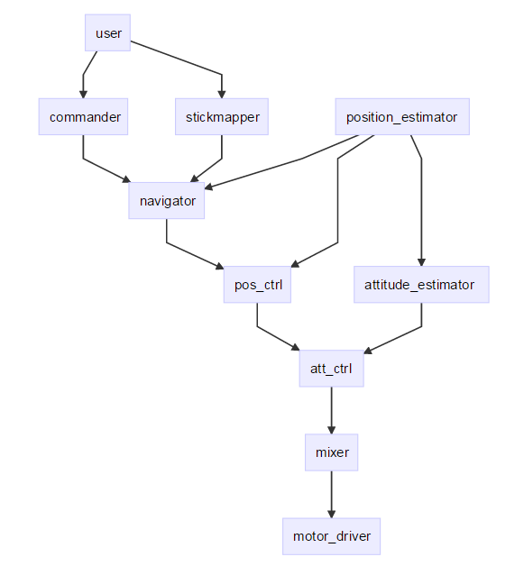

# 结构预览

PX4由两个层次组成：一是[飞行控制栈](../2_Concepts/flight_stack.md)，即自驾仪的软件解决方案，二是[中间件](../2_Concepts/middleware.md)，一种可以支持任意类型自主机器人的通用机器人中间件。

所有的[无人机机型](../7_Airframes/airframes.md)，事实上所有的机器人系统包括船舶，都具有同一代码库。整个系统设计是[反应式](http://www.reactivemanifesto.org)的，这意味着：

- 所有的功能被划分为可替换部件
- 通过异步消息传递进行通信
- 该系统可以应对不同的工作负载

除了这些运行时的考虑外，还需要使系统各模块最大程度地可重用。

## 高层软件结构

下面每一块都是单独的模块，不论是在代码，依赖性甚至是在运行时都是独立的。每个箭头是一种通过[uORB](../6_Middleware-and-Architecture/uorb_messaging.md)进行发布/订阅调用的连接。

> <aside class="tip">
> PX4结构允许其即使是在运行时，也可以快速方便地交换各个单独的模块。
> </aside>

控制器/混控器是针对于特定机型的（如多旋翼，垂直起降或其他飞机），但是高层任务管理模块如控制模块，导航模块是可以在不同平台共享的。

## 地面站通讯架构

与地面站（GCS）之间的交互是通过“商业逻辑”应用如指令应用（一般命令与控制，例如武装），导航应用（接受任务并将其转为底层导航的原始数据）和mavlink应用，mavlink该应用用于接受MAVLINK数据包并将其转为板级uORB数据结构。这种隔离方式使架构更为清晰，可以避免MAVLink对系统的深度依赖。MAVLink应用也获取了大量的传感器数据和状态估计值，并将其发送到地面站。

