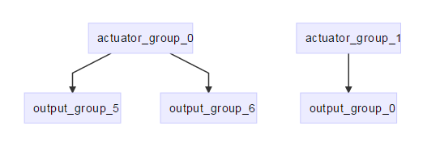

# 混控输出

# Mixing and Actuators

The PX4 architecture ensures that the airframe layout does not require special case handling in the core controllers.

Mixing means to take force commands (e.g. `turn right`) and translate them to actuator commands which control motors or servos. For a plane with one servo per aileron this means to command one of them high and the other low. The same applies for multicopters: Pitching forward requires changing the speed of all motors.

Separating the mixer logic from the actual attitude controller greatly improves reusability.

## Key Concepts

PX4 uses control groups (inputs) and output groups. Conceptionally they are very simple: A control group is e.g. `attitude`, for the core flight controls, or `gimbal` for payload. An output group is one physical bus, e.g. the first 8 PWM outputs for servos. Each of these groups has 8 normalized (-1..+1) command ports, which can be mapped and sclaled through the mixer. A mixer defines how each of these 8 signals of the controls are connected to the 8 outputs.

For a simple plane control 0 (roll) is connected straight to output 0 (elevator). For a multicopter things are a bit different: control 0 (roll) is connected to all four motors and combined with throttle.

## Mapping

Since there are multiple control groups (like flight controls, payload, etc.) and multiple output groups (first 8 PWM outpus, UAVCAN, etc.), one control group can send command to multiple output groups.



## PX4 mixer definitions

Files in ROMFS/px4fmu_common/mixers implement mixers are used for predefined airframes. They can be used as a basis
for customisation, or for general testing purposes.

### Syntax

Mixer definitions are text files; lines beginning with a single capital letter
followed by a colon are significant. All other lines are ignored, meaning that
explanatory text can be freely mixed with the definitions.

Each file may define more than one mixer; the allocation of mixers to actuators
is specific to the device reading the mixer definition, and the number of
actuator outputs generated by a mixer is specific to the mixer.

For example: each simple or null mixer is assigned to outputs 1 to x
in the order they appear in the mixer file.

A mixer begins with a line of the form

```
<tag>: <mixer arguments>
```

The tag selects the mixer type; 'M' for a simple summing mixer, 'R' for a 
multirotor mixer, etc.

#### Null Mixer

A null mixer consumes no controls and generates a single actuator output whose
value is always zero.  Typically a null mixer is used as a placeholder in a
collection of mixers in order to achieve a specific pattern of actuator outputs.

The null mixer definition has the form:

```
Z:
```

#### Simple Mixer

A simple mixer combines zero or more control inputs into a single actuator
output.  Inputs are scaled, and the mixing function sums the result before
applying an output scaler.

A simple mixer definition begins with:

```
M: <control count>
O: <-ve scale> <+ve scale> <offset> <lower limit> <upper limit>
```

If `<control count>` is zero, the sum is effectively zero and the mixer will
output a fixed value that is `<offset>` constrained by `<lower limit>` and `<upper
limit>`.

The second line defines the output scaler with scaler parameters as discussed
above. Whilst the calculations are performed as floating-point operations, the
values stored in the definition file are scaled by a factor of 10000; i.e. an
offset of -0.5 is encoded as -5000.

The definition continues with `<control count>` entries describing the control
inputs and their scaling, in the form:

```
S: <group> <index> <-ve scale> <+ve scale> <offset> <lower limit> <upper limit>
```

The `<group>` value identifies the control group from which the scaler will read,
and the `<index>` value an offset within that group.  These values are specific to
the device reading the mixer definition.

When used to mix vehicle controls, mixer group zero is the vehicle attitude
control group, and index values zero through three are normally roll, pitch,
yaw and thrust respectively.

The remaining fields on the line configure the control scaler with parameters as
discussed above. Whilst the calculations are performed as floating-point
operations, the values stored in the definition file are scaled by a factor of
10000; i.e. an offset of -0.5 is encoded as -5000.

#### Multirotor Mixer

The multirotor mixer combines four control inputs (roll, pitch, yaw, thrust)
into a set of actuator outputs intended to drive motor speed controllers.

The mixer definition is a single line of the form:

```
R: <geometry> <roll scale> <pitch scale> <yaw scale> <deadband>
```

The supported geometries include:

- 4x - quadrotor in X configuration
- 4+ - quadrotor in + configuration
- 6x - hexcopter in X configuration
- 6+ - hexcopter in + configuration
- 8x - octocopter in X configuration
- 8+ - octocopter in + configuration

Each of the roll, pitch and yaw scale values determine scaling of the roll,
pitch and yaw controls relative to the thrust control.  Whilst the calculations
are performed as floating-point operations, the values stored in the definition
file are scaled by a factor of 10000; i.e. an factor of 0.5 is encoded as 5000.

Roll, pitch and yaw inputs are expected to range from -1.0 to 1.0, whilst the
thrust input ranges from 0.0 to 1.0.  Output for each actuator is in the 
range -1.0 to 1.0.

In the case where an actuator saturates, all actuator values are rescaled so that 
the saturating actuator is limited to 1.0.