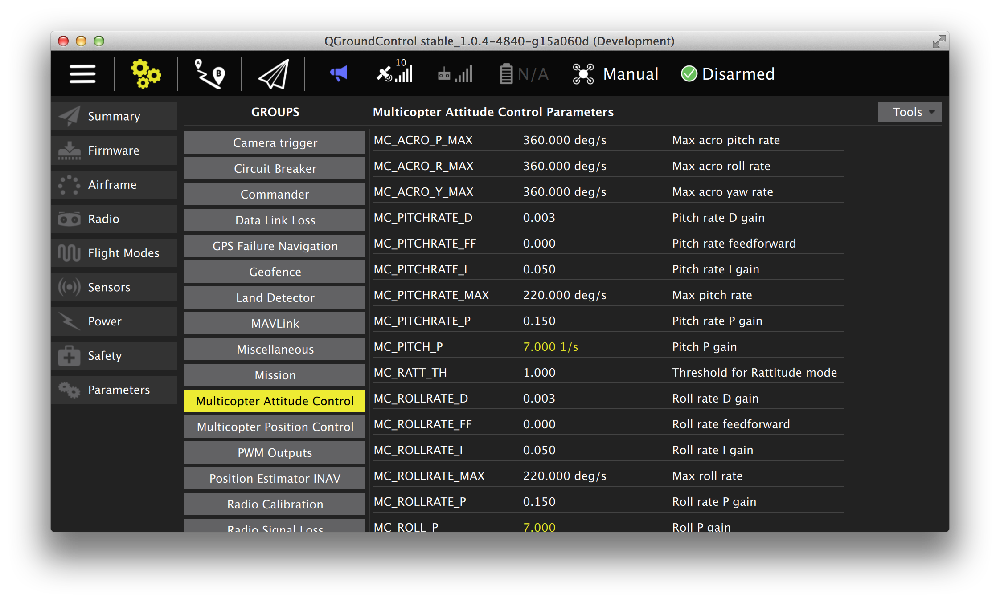

# QGC地面站

# QGroundControl

QGroundControl是一个基于PX4自动驾驶仪配置和飞行的应用程序。 并且跨平台支持所有的主流操作系统：

- 手机系统: Android 和 iOS (目前专注于平板电脑)
- 桌面系统: Windows, Linux, Mac OS

## 任务规划

规划一个新的任务, 切换到任务菜单, 点击左上角的“+”图标然后在地图上单击创建出一个任务点。同时在旁边将打开一个快捷菜单用来调整任务点。点击高亮的任务发送图标把任务信息发送到驾驶仪设备。

## 任务飞行

切换到飞行菜单。让地图上的任务路径保持可见。点击当前的飞行模式使其变为任务模式并且点击锁定按钮来解锁飞行器。如果飞行器已经飞行在空中它将直接飞向第一个任务点并且跟随任务路径飞行。。

 

## 参数设置

切换到设置菜单。滚动左边的菜单到最底部并且点击参数图标。可以通过双击某一项参数来弹出一个带有详细信息描述的可编辑菜单来改变参数。

## 安装

QGroundControl可以从这里下载 [QGroundControl](http://qgroundcontrol.org/downloads).

<aside class="tip">
开发人员建议使用最新的版本，而不是稳定版本。
</aside>

## 从源代码编译

鼓励固件开发人员使用源代码来编译匹配他们飞行代码的版本。

查看 [QGroundControl编译说明](https://github.com/mavlink/qgroundcontrol#obtaining-source-code) 来学习安装Qt以及编译源代码。
