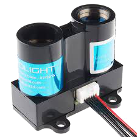
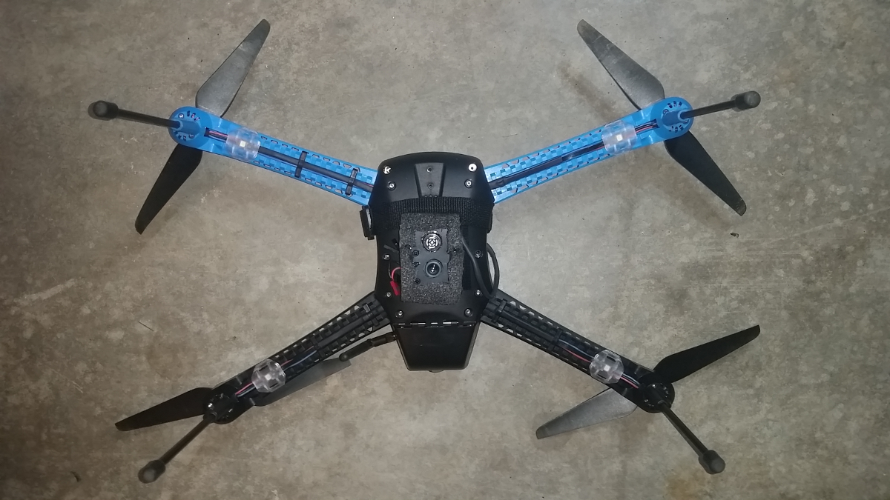
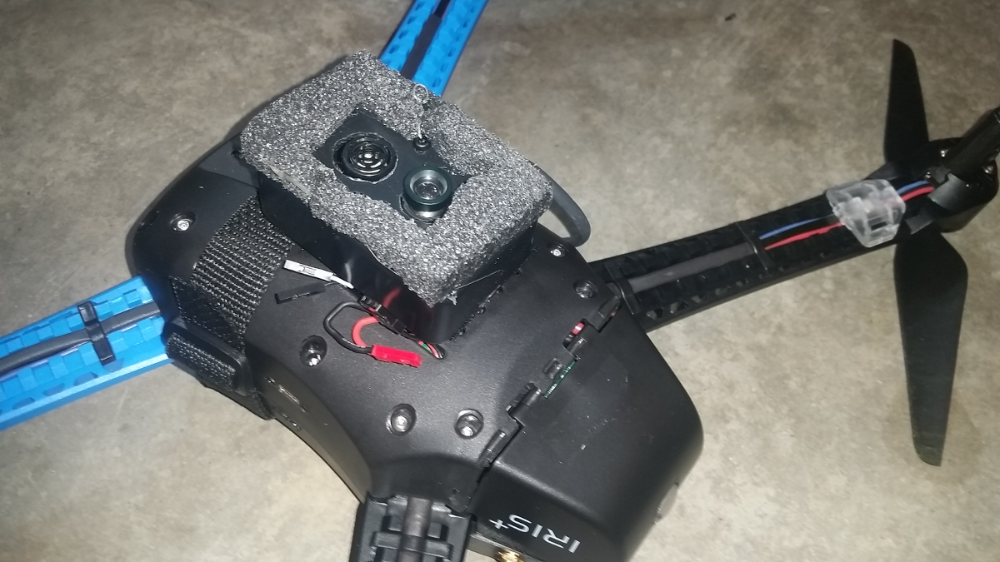

# 户外光流

---
官网英文原文地址：http://dev.px4.io/optical-flow-outdoors.html

本页面向您介绍如何设置PX4Flow用于位置估计以及户外自主飞行。LIDAR(激光雷达)的使用并非必要，但其的确会提升性能。

## 选择LPE（Local Position Estimator）估计器
---

唯一被测试的可以与基于户外自主飞行的光流共同作用的估计器就是LPE。

使用 `SYS_MC_EST_GROUP = 1` 参数来选择估计器然后重启飞控板。

## 硬件
---

*图 1: 装配坐标系（相对于下面的参数）*

*图 2: PX4FLOW光流传感器（相机以及声呐）*

PX4Flow必须指向地面，可以使用Pixhawk上的I2C接口进行连接。为了使PX4Flow获得最好的性能，确保将其放置在一个好的位置，同时不要暴露在强烈震动环境下。（最好是将其放置在四轴飞行器的底部）

>**注意： PX4Flow放置的默认的方位是其声呐侧（光流上的+Y）指向飞行器的+X(前面)。如果不是，则需要相应的设置` SENS_FLOW_ROT `**

*图 3: Lidar Lite*

存在包括Lidar-Lite（目前已经不生产）和 [sf10a](http://www.lightware.co.za/shop/en/drone-altimeters/33-sf10a.html) 在内的一些LIDAR设备可供选择。有关LIDAR-Lite的连接请参考[这里](https://pixhawk.org/peripherals/rangefinder?s[]=lidar)，其中sf10a可以通过串行总线与Pixhawk相连。

*图4: 装有PX4Flow/ Lidar-Lite的DJI F450*

*图5: 这个Iris+上装有一个不带LIDAR的PX4Flow，其同样可以对LPE估计器起作用*

*图6: 为PX4Flow搭建了一个天气保护盒子。用泡沫包裹着盒子一是可以降低声呐读取的螺旋桨噪声，同时还可以保护相机免受碰撞。*

## 相机聚焦
---

为了保证好的光流质量，将PX4Flow上的的相机聚焦到一个理想的飞行高度是十分重要的。要让相机聚焦，首先准备一个带有文字的物体（例如，一本书），然后将PX4Flow插入到USB中，最后运行QGroundControl。在设置菜单下，选择PX4Flow，你会看到一个相机的拍摄得到的图片。通过拧动相机的固定螺母来放松或收紧镜头找到相机的焦点的方法进行聚焦。

**注意：如果你的飞行高度超过了3米，相机将聚焦在一个无限远的地方，对于在更高处的飞行，这一点不需要作改变 **

*图7：用一本书在你想要飞行的高度上完成光流相机的聚焦，一般在1-3米的范围内。超过3米时，应该将相机聚焦到一个无限远的位置，这样对于在更高处的飞行也适用*

*图8：QGroudControl地面站的px4flow光流界面可以被用来对相机进行聚焦*

## 传感器参数
---

All the parameters can be changed in QGroundControl

- SENS_EN_LL40LS Set to 1 to enable lidar-lite distance measurements
- SENS_EN_SF0X Set to 1 to enable lightware distance measurements (e.g. sf02 and sf10a)

## Local Position Estimator (LPE)
---
LPE is an Extended Kalman Filter based estimator for position and velocity states. It uses inertial navigation and is similar to the INAV estimator below but it dynamically calculates the Kalman gain based on the state covariance. It also is capable of detecting faults, which is beneficial for sensors like sonar which can return invalid reads over soft surfaces.

## Flight Video Outdoor
---

Below is a plot of the autonomous mission from the outdoor flight video above using optical flow. GPS is not used to estimate the vehicle position but is plotted for a ground truth comparison. The offset between the GPS and flow data is due to the initialization of the estimator from user error on where it was placed. The initial placement is assumed to be at LPE_LAT and LPE_LON (described below).


<video id="my-video" class="video-js" controls preload="auto" width="100%" 
poster="../pictures/diagrams/opticsflow.png" data-setup='{"aspectRatio":"16:9"}'>
  <source src="http://7xvob5.com2.z0.glb.qiniucdn.com/Px4flow%20lpe%20estimator%20auto%20mission.mp4" type='video/mp4' >
  

    To view this video please enable JavaScript, and consider upgrading to a web browser that
    <a href="http://videojs.com/html5-video-support/" target="_blank">supports HTML5 video</a>
  

</video>


*Figure 4: LPE based autonomous mission with optical flow and sonar*

## Parameters
---
The local position estimator will automatically fuse LIDAR and optical flow data when the sensors are plugged in.

- LPE_FLOW_OFF_Z - This is the offset of the optical flow camera from the center of mass of the vehicle. This measures positive down and defaults to zero. This can be left zero for most typical configurations where the z offset is negligible.
- LPE_FLW_XY - Flow standard deviation in meters.
- LPW_FLW_QMIN - Minimum flow quality to accept measurement.
- LPE_SNR_Z -Sonar standard deviation in meters.
- LPE_SNR_OFF_Z - Offset of sonar sensor from center of mass.
- LPE_LDR_Z - Lidar standard deviation in meters.
- LPE_LDR_Z_OFF -Offset of lidar from center of mass.
- LPE_GPS_ON - You won't be able to fly without GPS if LPE_GPS_ON is set to 1. You must disable it or it will wait for GPS altitude to initialize position. This is so that GPS altitude will take precedence over baro altitude if GPS is available.

**NOTE: LPE_GPS_ON must be set to 0 to enable flight without GPS**

## Autonomous Flight Parameters
---
_Tell the vehicle where it is in the world_

- LPE_LAT - The latitude associated with the (0,0) coordinate in the local frame.
- LPE_LON - The longitude associated with the (0,0) coordinate in the local frame.

_Make the vehicle keep a low altitude and slow speed_

- MPC_ALT_MODE - Set this to 1 to enable terrain follow
- LPE_T_Z - This is the terrain process noise. If your environment is hilly, set it to 0.1, if it is a flat parking lot etc. set it to 0.01.
- MPC_XY_VEL_MAX - Set this to 2 to limit leaning
- MPC_XY_P - Decrease this to around 0.5 to limit leaning
- MIS_TAKEOFF_ALT - Set this to 2 meters to allow low altitude takeoffs.

_Waypoints_

- Create waypoints with altitude 3 meters or below.
- Do not create flight plans with extremely long distance, expect about 1m drift \/ 100 m of flight.

**Note: Before your first auto flight, walk the vehicle manually through the flight with the flow sensor to make sure it will trace the path you expect.**

