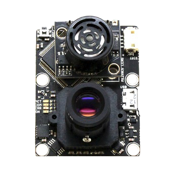
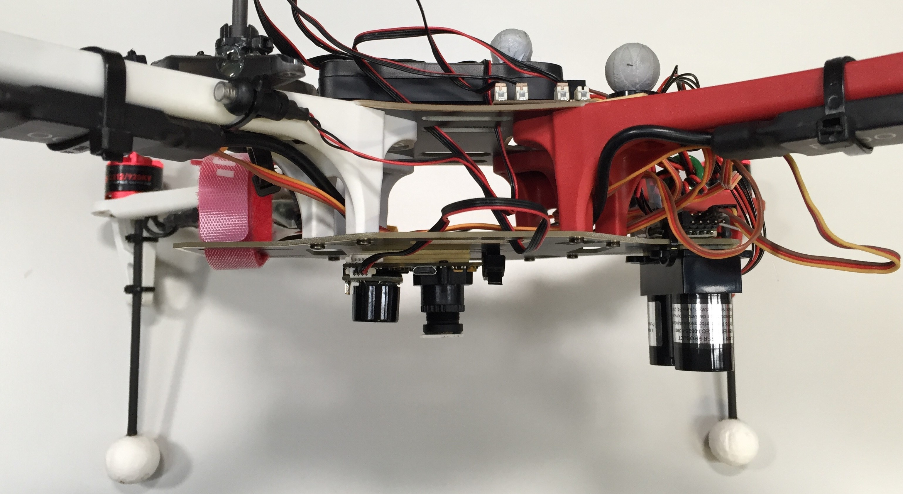

# 户外光流

---
官网英文原文地址：http://dev.px4.io/optical-flow-outdoors.html

本页面向您介绍如何设置PX4Flow用于位置估计以及户外自主飞行。LIDAR(激光雷达)的使用并非必要，但其的确会提升性能。

## 选择LPE（Local Position Estimator）估计器
---

唯一被测试的可以与基于户外自主飞行的光流共同作用的估计器就是LPE。

使用 `SYS_MC_EST_GROUP = 1` 参数来选择估计器然后重启飞控板。

## 硬件
---

*图 1: 装配坐标系（相对于下面的参数）*

*图 2: PX4FLOW光流传感器（相机以及声呐）*

PX4Flow必须指向地面，可以使用Pixhawk上的I2C接口进行连接。为了使PX4Flow获得最好的性能，确保将其放置在一个好的位置，同时不要暴露在强烈震动环境下。（最好是将其放置在四轴飞行器的底部）

>**注意： PX4Flow放置的默认的方位是其声呐侧（光流上的+Y）指向飞行器的+X(前面)。如果不是，则需要相应的设置` SENS_FLOW_ROT `**

*图 3: Lidar Lite*

存在包括Lidar-Lite（目前已经不生产）和 [sf10a](http://www.lightware.co.za/shop/en/drone-altimeters/33-sf10a.html) 在内的一些LIDAR设备可供选择。有关LIDAR-Lite的连接请参考[这里](https://pixhawk.org/peripherals/rangefinder?s[]=lidar)，其中sf10a可以通过串行总线与Pixhawk相连。

*图4: 装有PX4Flow/ Lidar-Lite的DJI F450*

*图5: 这个Iris+上装有一个不带LIDAR的PX4Flow，其同样可以对LPE估计器起作用*

*图6: 为PX4Flow搭建了一个天气保护盒子。用泡沫包裹着盒子一是可以降低声呐读取的螺旋桨噪声，同时还可以保护相机免受碰撞。*

## 相机聚焦
---

为了保证好的光流质量，将PX4Flow上的的相机聚焦到一个理想的飞行高度是十分重要的。要让相机聚焦，首先准备一个带有文字的物体（例如，一本书），然后将PX4Flow插入到USB中，最后运行QGroundControl。在设置菜单下，选择PX4Flow，你会看到一个相机的拍摄得到的图片。通过拧动相机的固定螺母来放松或收紧镜头找到相机的焦点的方法进行聚焦。

**注意：如果你的飞行高度超过了3米，相机将聚焦在一个无限远的地方，对于在更高处的飞行，这一点不需要作改变 **

*图7：用一本书在你想要飞行的高度上完成光流相机的聚焦，一般在1-3米的范围内。超过3米时，应该将相机聚焦到一个无限远的位置，这样对于在更高处的飞行也适用*

*图8：QGroudControl地面站的px4flow光流界面可以被用来对相机进行聚焦*

## 传感器参数
---

所有的参数都可以在QGroundControl中进行修改

- 将SEN_EN_LL40LS设置为1以使能lidar-lite进行距离测量
- 将SEN_EN_SF0X设置为1以使能lightware进行距离测量(例如.sf02和sf10a)

## Local Position Estimator (LPE)
---
LPE是一种基于扩展卡尔曼滤波器EKF的位置与速度估计器。LPE使用了惯性导航系统并且与INAV估计器有着类似的功能，但是它能够基于状态协方差动态地计算卡尔曼增益。LPE还可以检测故障，这个功能将使类似于声呐这种能够通过软件界面返回无效测量值的传感器更好的发挥作用。

## 户外飞行视频
---

下面是一个在户外使用光流进行自主任务飞行的视频以及飞行得到的绘图。虽说没有用到GPS来对飞行器的位置进行估计，但是图中还是将GPS的信息画出来用于地面实况比较。GPS和光流数据之间的偏移是由于用户安装光流的位置的初值估计误差。初始安装位置是在LPE\_LAT（经度）和LPE_LON（纬度）(在下面会进行说明)。


<video id="my-video" class="video-js" controls preload="auto" width="100%" 
poster="../pictures/diagrams/opticsflow.png" data-setup='{"aspectRatio":"16:9"}'>
  <source src="http://7xvob5.com2.z0.glb.qiniucdn.com/Px4flow%20lpe%20estimator%20auto%20mission.mp4" type='video/mp4' >
  

    To view this video please enable JavaScript, and consider upgrading to a web browser that
    <a href="http://videojs.com/html5-video-support/" target="_blank">supports HTML5 video</a>
  

</video>


*图9: 带有光流和声呐的飞行器基于LPE的自主任务飞行*

## 参数
---
当传感器插入时，LPE会自动融合LIDAR和光流测量的数据。

- LPE_FLOW_OFF_Z - 这是光流相机距飞行器重心的偏移。该值向下为正，默认为0。在绝大多数正常安装的情况下，该值可以保持为0，因为z轴上的偏移微不足道。
- LPE_FLW_XY - 光流的标准差，单位米。
- LPW_FLW_QMIN - 可接受测量的光流质量最小值。
- LPE_SNR_Z -声呐的标准差，单位米。
- LPE_SNR_OFF_Z - 声呐传感器距飞行器重心的偏移。
- LPE_LDR_Z - 激光雷达Lidar的标准差，单位米。
- LPE_LDR_Z_OFF -Lidar距飞行器重心的偏移。
- LPE_GPS_ON - 如果参数LPE_GPS_ON设置为1，在没有GPS的情况下飞行器将无法飞行。必须禁用此项或者等待GPS获得高度信息并将位置初始化。这是为了当GPS可用时由GPS获得的高度信息优先级高于气压计获得的高度信息。

**注意：在没有GPS的情况下,必须将参数LPE_GPS_ON置0才能飞行**

## 自主飞行参数
---
_告诉飞行器它的当前位置_

- LPE_LAT - 与机体坐标系中坐标(0,0)相关联的纬度。
- LPE_LON - 与机体坐标系中坐标(0,0)相关联的经度。

_让飞行器保持一个很低的高度与速度_

- MPC_ALT_MODE - 将此值设置为1以使能地形跟踪
- LPE_T_Z - 这是地形的过程噪声。如果在丘陵地带飞行，将此值设置为0.1，如果是在一个平坦的停车场等类似的地方飞行，则可将此值设置为0.01。
- MPC_XY_VEL_MAX - 将此值设置为2以限制倾斜
- MPC_XY_P - 将此值降低到0.5以限制倾斜。
- MIS_TAKEOFF_ALT - 将此值设置为2米以允许低空起飞。

_航点_

- 在高度3米或更低处创建航点.
- Do not create flight plans with extremely long distance, expect about 1m drift \/ 100 m of flight.不要使用很长的距离创建飞行计划，

**Note: Before your first auto flight, walk the vehicle manually through the flight with the flow sensor to make sure it will trace the path you expect.**

