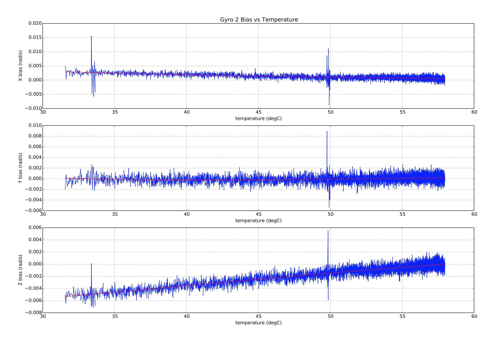
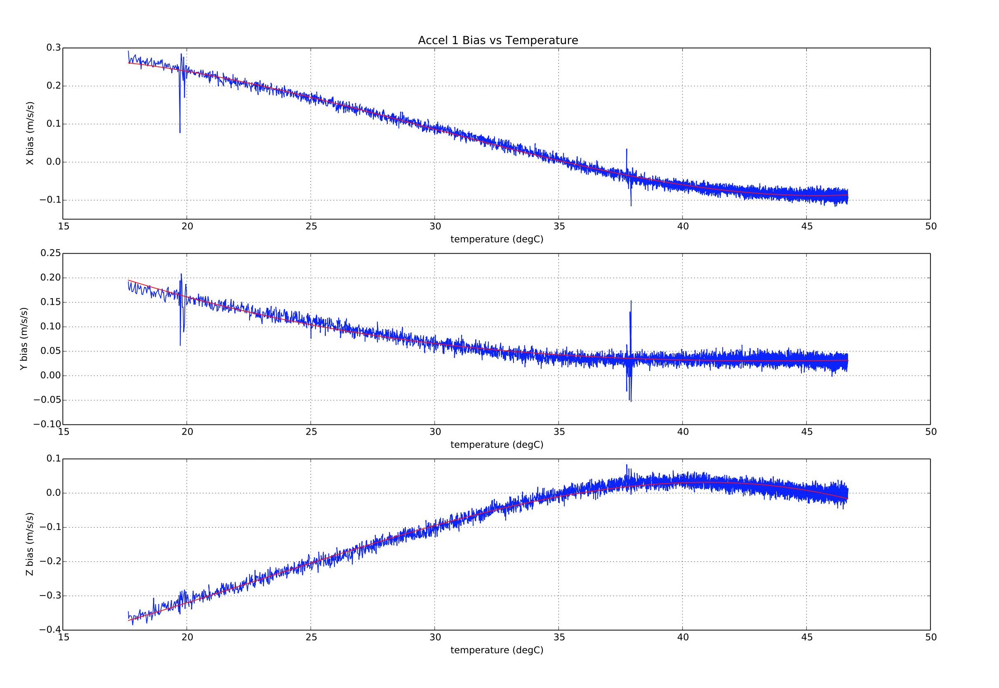
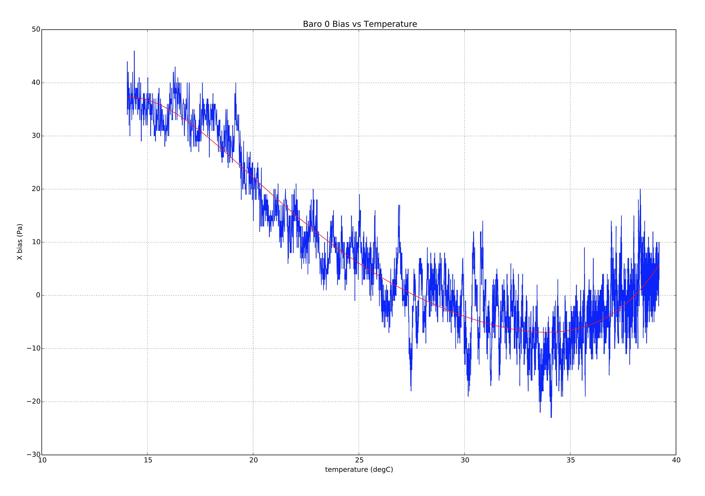

# Thermal Calibration and Compensation

官网英文原文地址：https://dev.px4.io/sensor-thermal-calibration.html

## Overview

PX4 conains functionality to calibrate and compensate rate gyro, accelerometer and barometric pressure sensors for the effect of changing sensor temperature on sensor bias. Calibration refers to the process of measuring the change in sensor value across a range of internal temperatures and performing a polynomial fit on the data to calculate a set of coefficients stored as parameters that can be used to correct the sensor data. Compensation refers to the process of using the internal temperature to calculate an offset which is subtracted from the sensor reading to correct for changing offset with temperature

The inertial rate gyro and accelerometer sensor offsets are calculated using a 3rd order polynomial, whereas the barometric pressure sensor offset is calculated using a 5th order polynomial. Examples fits are show below:







## Calibration Parameter Storage

With the existing parameter system implementation we are limited to storing each value in the struct as a separate entry. To work around this limitation the following logical naming convention for the parameters is used:

TC_[type][instance]_[cal_name]_[axis] , where

* [type] : is a single character indicating the type of sensor where G = rate gyroscope, A = accelerometer and B = barometer

* [instance] : is an integer 0,1 or 2 allowing for calibration of up to three sensors of the same [type]

* [cal_name] : is a string identifyng the calibration value with the following possible values:
  * Xn : Polynomial coefficient where n is the order of the coefficient, eg X3 * (temperature - reference temperature)**3
  * SCL : scale factor
  * TREF : reference temperature (deg C)
  * TMIN : minimum valid temperature (deg C)
  * TMAX : maximum valid temperature (deg C)
* [axis] : is an integer 0,1 or 2 indicating that the cal data is for X,Y or Z axis in the board frame of reference. for the barometric pressure sensor, the _<axis> suffix is omitted.

Examples:

TC_G0_X3_0 is the ^3 coefficient for the first gyro x-axis

TC_A1_TREF is the reference temperature for the second accelerometer

## Calibration Parameter Useage

The correction for thermal offsets using the calibration parameters is performed in the sensors module. The reference temperature is subtracted from the measured temperature to obtain a delta temperature where:

```
delta = measured_temperature - refernece_temperature.
```
The delta temperature is then used to calculate a offset, where:
```
offset = X0 + X1*delta + X2*delta**2 + ... + Xn*delta**n
```
The offset and temperature scale factor are then used to correct the sensor measurement where:
```
corrected_measurement = (raw_measurement - offset) * scale_factor
```
If the temperature is above the test range set by the *_TMIN and *_TMAX parameters, then the measured temperature will be clipped to remain within the limits.

Correction os the accelerometer, barometers or rate gyroscope data is enabled by setting TC_A_ENABLE_, _TC_B_ENABLE or TC_G_ENABLE parameters to 1 respectively.

## Compatibility with legacy CAL_* parameters and commander controlled calibration

The legacy temperature agnostic PX4 rate gyro and accelerometer sensor calibration is performed by the commander module and involves adjusting offset, and in the case of accelerometer calibration, scale factor calibraton parameters. The offset and scale fator parameters are applied within the driver for each sensor. These parameters are found in the CAL parameter group.

Onboard temperature calibration is controlled by the events module and the corrections are applied within the sensors module before the sensor combined uORB topic is published. This means that if thermal compensation is being used, all of the corresponding legacy offset and scale factor parameters must be set to defaults of zero and unity before a thermal calibration is performed. If an on-board temperature calibration is performed, this will be done automatically, however if an offboard calibration is being performed it is important that the legacy CAL*OFF and CAL*SCALE parameters be reset before calibration data is logged.

If gyro thermal compensation has been enabled by setting the TC__G__ENABLE parameter to 1, then the commander controlled gyro calibration can still be perfomred, however it will be used to shift the compensation curve up or down by the amount required to zero the angular rate offset. It achieves this by adjusting the X0 coefficients.

If accel thermal compensation has been enabled by setting the TC_A_ENABLE parameter to 1, then the commander controlled 6-point accel calibration can still be perfomred, however in stead of adjusting the *OFF and *SCALE parameters in the CAL parameter group, these parameters are set to defaults and the thermal compensation X0 and SCL parameters are adjusted instead.

## Limitations

Scale factors are assumed to be temperature invariant due to the difficulty associated with measuring these at different temperatures. This limits the usefulness of the accelerometer calibration to those sensor models with stable scale factors. In theory with a thermal chamber or IMU heater capable of controlling IMU internal temperature to within a degree, it would be possible to perform a series of 6 sided accelerometer calibrations and correct the acclerometers for both offset and scale factor. Due to the complexity of integrating the required board movement with the calibration algorithm, this capability has not been included.

## Onboard Calibration Procedure

This method is simpler and faster than the off-board method, but does require knowledge off the amount of temperature rise that is achievable with the test setup. It does not provide a method to visually check the quality of the data and curve-fit.

1. Ensure the frame type is set before calibration, otherwise calibration parameters will be lost when the board is setup
2. Power the board and set the SYS_CAL_* parameters to 1 to enable calibration of the required sensors at the next startup. 1
3. Set the SYS_CAL_TDEL parameter to the number of degrees of temperature rise required for the onboard calibrator. to complete. If this parameter is too small, then the calibration will complete early and the temperature range for the calibration will not be sufficient to compensate then the board is fully warmed up. If this parameter is set too large, then the onboard calibrator will never complete. allowance should be made for the rise in temperature due to the boards self heating when setting this parameter. If the amount of temperature rise at the sensors is unknown, then the off-board method should be used.
4. Set the SYS_CAL_TMIN parameter to the lowest temperature data that you want the calibrator to use. This enables a lower cold soak ambient temperature to be used to reduce the cold soak time whilst maintaining control over the calibration mnimum temperature. The data for a sensor will not be used by the calibrator if it is below the value set by this parameter.
5. Set the SYS_CAL_TMAX parameter to the highest starting sensor temperature that should be accepted by the calibrator. If the starting temperature is higher than the value set by this parameter, the calibration will exit with an error. Note that if the variation in measured temperature between different sensors exceeds the gap between SYS_CAL_TMAX and SYS_CAL_TMIN, then it will be impossible for the calibration to start.
6. Remove power and cold soak the board to below the starting temperature specified by the SYS_CAL_TMIN parameter. Note that there is a 10 second delay on startup before calibration starts to allow any sensors to stabilise and the sensors will warm internally during this period.
   Keeping the board stationary2, apply power and warm to a temperature high enough to achieve the temperature rise specified by the SYS_CAL_TDEL parameter. The completion percentage is printed to the system console during calibration. 3
7. When the calibration completes, remove power, allow the board to cool to a temperature that is within the calibration range before performing the next step.
8. Perform a 6-point accel calibration via the system console using 'commander calibrate accel' or via QGC. If the board is being set-up for the first time, the gyro and magnetometer calibration will also need to be performed.
9. The board should always be re-powered after any sensor calibration before flying, because sudden offset changes from calibration can upset the navigation estimator and some parameters are not loaded by the algorithms that use them until the next startup.

## Offboard Calibration Procedure

This method provides a way to visually check the quality of data and curve fit but is a more complex procedure requiring more human intervention.
1. Ensure the frame type is set before calibration, otherwise calibration parameters will be lost when the board is setup
2. Power up the board and set the TC_A_ENABLE, TC_B_ENABLE and TC_G_ENABLE parameters to 1
3. Set all CAL_GYR and CAL_ACC parameters to defaults
4. Set the SYS_LOGGER parameter to 1 to use the new system logger
5. Set the SDLOG_MODE parameter to 3 to enable logging of sensor data for calibration and remove power.
6. Cold soak the board to the minimum temperature it will be required to operate in.
7. Apply power and keeping the board still 2, warm it slowly to the maximum required operating temperature. 3
8. Remove power and extract the .ulog file
9. Open a terminal window in the Firmware/Tools directory and run the python calibration script script file: 'python process_sensor_caldata.py . This will generate a .pdf file showing the measured data and curve fits for each sensor, and a .params file containing the calibration parameters.
10. Power the board, connect QGC and load the parameter from the generated .params file onto the board using QGC. Due to the number of parameters, loading them may take some time.
11. After parameters have finished loading, set SDLOG_MODE to 1 to re-enable normal logging and remove power.
12. Power the board and perform a normal accelerometer sensor calibration using QGC. It is important that this step is performed when board is within the calibration temperature range. The board must be repowered after this step before flying as the sudden offset changes can upset the navigation estimator and some parameters are not loaded by the algorithms that use them until the next startup.

> 1. The SYS_CAL_ACCEL, SYS_CAL_BARO and SYS_CAL_GYRO parameters are reset to 0 when the calibration is started. ↩
> 2. Calibration of the barometric pressure sensor offsets requires a stable air pressure environment. The air pressure will change slowly due to weather and inside buildings can change rapidly due to external wind fluctuations and HVAC system operation. ↩
> 3. Care must be taken when warming a cold soaked board to avoid formation of condensation on the board that can cause board damage under some circumstances. ↩


