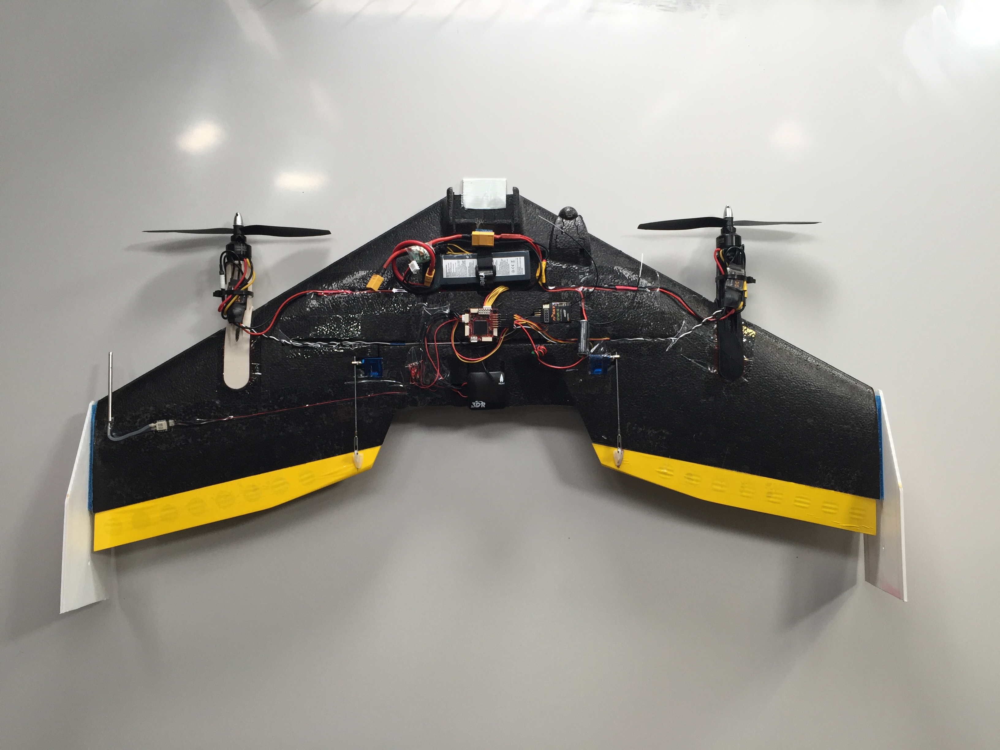

# TBS Caipiroshka

由TBS Caipirinha稍作修改得到垂直起降型Caipiroshka。

[视频：PX4 VTOL - Call for Testpilots](http://7xw24i.com1.z0.glb.clouddn.com/PX4%20VTOL%20-%20Call%20for%20Testpilots.mp4)

## 部件列表

- TBS Caipirinha飞翼([Eflight商店](http://www.eflight.ch/shop/USER_ARTIKEL_HANDLING_AUFRUF.php?von_suchresultat=true&Ziel_ID=19638&Kategorie_ID=110923))
- 3D打印的左右电机支架([设计文件](parts/motor_mounts.zip))
- 顺时针8045螺旋桨([Eflight商店](http://www.eflight.ch/shop/USER_ARTIKEL_HANDLING_AUFRUF.php?von_suchresultat=true&Ziel_ID=19532&Kategorie_ID=288))
- 逆时针8045螺旋桨([Eflight商店](http://www.eflight.ch/shop/USER_ARTIKEL_HANDLING_AUFRUF.php?von_suchresultat=true&Ziel_ID=19533&Kategorie_ID=288))
- 2个1800 kV 120-180W电机
	- [Quanum MT2208 1800 kV](http://www.hobbyking.com/hobbyking/store/__67014__Quanum_MT_Series_2208_1800KV_Brushless_Multirotor_Motor_Built_by_DYS.html)
	- [ePower 2208](http://www.eflight.ch/pi/ePower-X-22081.html)
- 2个20-30S电调([Eflight商店](http://www.eflight.ch/shop/USER_ARTIKEL_HANDLING_AUFRUF.php?von_suchresultat=true&Ziel_ID=19713&Kategorie_ID=36077))
- BEC(3A, 5-5.3V)（使用的电调不具备5V电源输出功能时选用）
- 3S 2200 mA锂电池
	- Team Orion 3S 11.1V 50 C ([Brack商店](https://www.brack.ch/team-orion-2200mah-11-1v-50c-308340))
- [Pixracer飞控板 + 电源模块](hardware-pixracer.md)
- [电子空速传感器](http://www.hobbyking.com/hobbyking/store/__62752__HKPilot_32_Digital_Air_Speed_Sensor_And_Pitot_Tube_Set.html)

## 组装

下图展示了组装完成的Caipiroshka的样子



下面是一些关于如何组装该飞行器的提示

### 飞控板

飞控板应该放置在中间靠近飞行器质心的位置。

### 电机支架

打印2个电机支架，STL文件在部件列表中已经给出。在机翼的两边各固定1个电机支架，保证电机的轴线大体通过副翼的中心（参照图片）。上图中两个电机支架的水平距离为56cm。在机翼上标记了支架的正确位置后，用透明胶带覆盖支架连接区域的上下表面。然后在该区域涂上一层热熔胶，接着把支架粘到机翼上。在机翼表面与热熔胶之间加入一层透明胶带，可以让你更加容易地拆除电机支架，仅仅撕下胶带即可，同时这样做也不会破坏机翼。当要替换掉损坏的电机支架时，这么做就会非常有用。

### 电机控制器

电机控制器可以直接用胶水或者扎带固定在电机支架的平坦表面上。可以使用旧烙铁在泡沫表面烧出渠道，以此作为连接到电极的线路。把两个电机的电源线连接到一起，并在末端焊接一个插头，这样做就可以同时连接两个电机和电源模块了。如果电机控制器不能为尾推提供5V电源，那么你还需要额外的BEC。

### GPS

GPS可以挂载在机身的中后部，这样做有助于机身重心后移，因为2个电机，1个相机，还有可能包括大电池都将使机鼻过重。这样做也可以使GPS远离电源线，有利于减小对外置罗盘的干扰。

### 空速传感器

皮托管需要固定在机翼外侧以保证不受螺旋桨气流的干扰。皮托管到电机轴线的水平距离应该大于螺旋桨的半径。同样的，用旧烙铁为皮托管以及空速传感器划出凹槽（参照图片），并划出到其它部件的连接渠道。

### I2C设备

空速传感器和外置罗盘（在GPS外罩里）都需要连接到飞控板的I2C总线，因此，还需要一个I2C分线板。把分线板连接到飞控板的I2C总线上，然后用标准I2C线把外置罗盘和空速传感器连接到分线板上。在上图中，分线板位于GPS模块的左侧。

### 副翼

使用透明胶带把副翼连接到机翼的后部，可以参照Blacksheep团队在TBS Caiprinha组装手册中给出的操作指南。

### 通用组装原则

在把所有部件固定到机身之前，先用透明胶带把它们暂时固定在合适的位置并检查重心是否在TBS Caipirinha组装手册中推荐的范围内。根据你想要添加的额外部件（GoPro或者大电池），调整这些部件的位置。

## 机型配置

在[QGroundControl](../3_Tutorial/ground_control_station.md)中切换到配置页面并打开机型选项卡，滚动列表寻找垂直起降双旋翼尾座型图标，在下拉菜单中选择```Duorotor Tailsitter```


## 舵机连接

下表中的描述假设飞行器平放在桌子上，机腹向下，用户位于飞行器前方，面对飞行器。

| 输出  | 频率   | 作动器               |
| ------ | ------ | ---------------------- |
| MAIN1  | 400 Hz | 左电机  |
| MAIN2  | 400 Hz | 右电机 |
| MAIN3  | 400 Hz | 空                  |
| MAIN4  | 400 Hz | 空                  |
| MAIN5  | 50 Hz  | 左副翼     |
| MAIN6  | 50 Hz  | 右副翼   |

