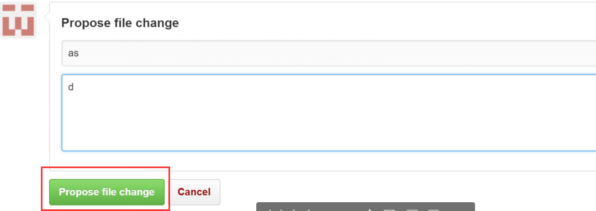
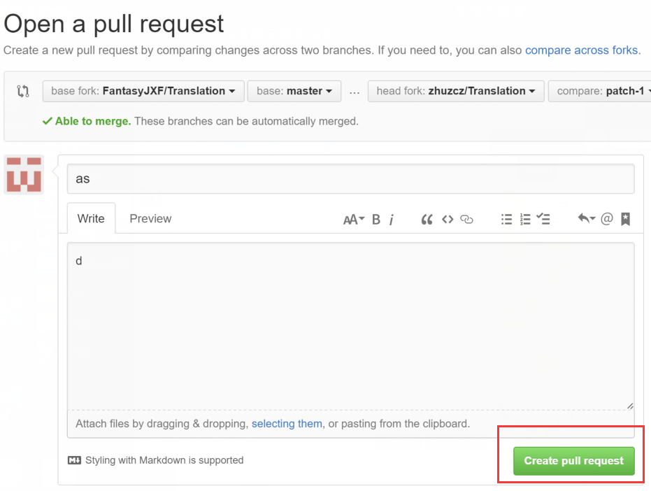
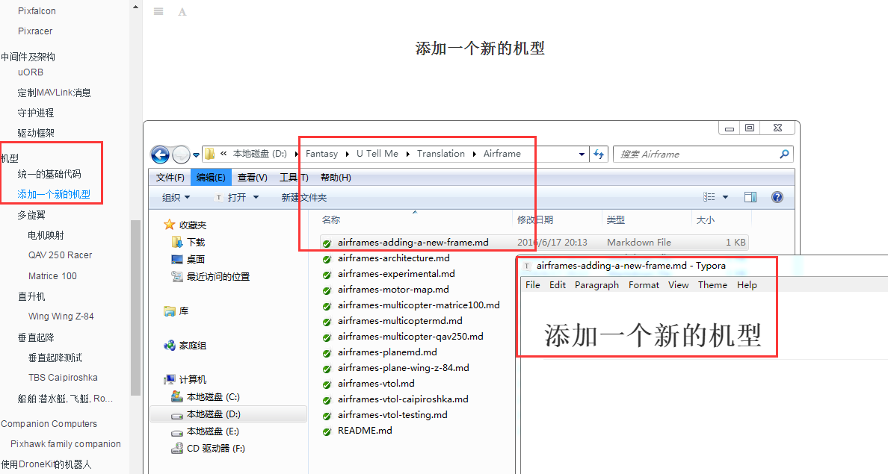

PX4中文维基
--- 

<font color = red size = 6>PX4中文维基现已与PX4开发者官网https://dev.px4.io/合并</font>

<font color = red size = 6>今后的中文维护将只会在官网进行，望各位继续支持，为汉化多多提出宝贵意见</font>

---

PX4中文维基由PX4开发者兼爱好者志愿翻译。

欢迎使用评论系统以及在线编辑功能。

欢迎交流，共同进步。

---
---
* **GitBook **

与官网的方式相同，我们也是将网站以GitBook的方式呈现给大家。
Gitbook是一个命令行工具，可以把你的Markdown文件汇集成电子书，并提供PDF等多种格式输出。你可以把Gitbook生成的HTML发布出来，就形成了一个简单的静态网站，就像现在你所看到的。
用CSDN博客的相信大家都不会陌生Markdown这个工具。
不多说，[点进来][1]你就知道怎么使用了。
[1]: http://www.jianshu.com/p/21d355525bdf/comments/79044

* **Github**

这里我已经[将GitBook托管到了Github上][2]，大家感兴趣的可以fork下来一起完成这项工程谈不上浩大的工作，我想你也常常为打开官网望去满眼的英文而苦恼吧，来吧，我们可以做点什么的。fork地址在[这里][6].
[2]: http://www.jianshu.com/p/5d0b25cd9495
[6]: https://github.com/FantasyJXF/Translation.git

* **Git**

Git这个工具非常重要，且简单易学有意思，不妨掌握一下，技多不压身。关于Git的学习点我们的擎天柱[luoshi006][3],还有不得不说[廖雪峰的官方网站][4]也是极好的，无意间发现[Git Community Book中文版](http://gitbook.liuhui998.com/),循序渐进吧。
[3]: http://blog.csdn.net/luoshi006/article/details/51472123
[4]: http://www.liaoxuefeng.com/wiki/0013739516305929606dd18361248578c67b8067c8c017b000


最后还是诚邀志同道合的同志加入PX4中文维基的汉化组。
联系方式：<font face="Vijaya" size 10>  QQ群: 499861916</font> 


                                      <font face="Segoe Script" size 12>From Fantasy</font> 

 ---
####参与维护

1. **网页端编辑**（<font color=#DC143C size=72>**强烈推荐**</font>：非常简单，只需三步就可以完成你的贡献）
   - 在浏览在线页面时进行编辑本页，这样，只要你看到不妥的地方立马可以修改，具体如下图
      

   - 或者也可以直接打开github中[网页端][8]进入要进行编辑的文件，如下图
[8]: https://github.com/FantasyJXF/Translation
  
​	  

    - 开始编辑：进入编辑页面后，对文件进行修改，会出现如下图问题


	- 按照提示，点击`Fork this repository and propose chanes`，进入即可编辑，如下图
 
​		

    - 提交贡献：首先提名文件更改，如下图

​    

    - 检查是否与原有版本有冲突，如果有，解决冲突再提交，没有则提交，如下图


- 剩下来就是版主的事了，如果没有太大的问题，版主就可以合并分支了，到这你的对本文档的贡献就完成了。

1. 本地编辑（git高级用户推荐）

   相对于网页端编辑，本地编辑只是编辑在本地，后期的提交分支还是得在网页端进行，不过在此之前你得fork本项目到你的仓库。
   

   然后进行如下操作

   ```sh
   #下载你的项目到本地
   git clone https://github.com/FantasyJXF/Translation.git

   #进入文件夹进行编辑即可，完成后如下操作

   git add .
   #这里可以看到你的更改状况

   git status
   #添加你的更改备注，让别人知道你干了什么

   git commit -m "your comment"
   #提交更改

   git pull https://github.com/FantasyJXF/Translation.git master
   #检查是否与Fantasy云端产生冲突，如果有，解决冲突后重新git commit -m "your comment"

   git push origin master
   #推送到个人云端
   ```

2. 到这里为止，还只对你自己的仓库进行了修改，你需要`new pull request`提交分支到FantasyJXF的仓库，如下图，可以看出，如果只是少量的更改，建议使用网页端编辑。
   
   ​

   ### 注意看这里

   <font color=DC143C>

   为了方便大家能够更好的参与进维护工作，现做了一些准备工作。</font>

   1. **分类**。文件对应到各自的文件夹。图片集中存放。

      

   2. **格式**。当大家打开需要翻译的文件的时候，格式已经与官网一致了！关于图片、视频、.md文件的链接、引用的超链接以及代码段已经设置完毕了，大家不用再去修改。只需要将相应部分的原文进行替换即可，保证大家<font color=#DC143C size=24>到手即翻</font>，什么基础都不需要就能够轻松完成贡献。

   3. **不足之处**。不愿意将就，源于官网，异于官网。内容虽说大致与官网上一致，但是鉴于官网的更新难以捉摸，目前本网站的版本与官网还存在小不同，但是不影响。本网站上的视频都是Youtube上的，翻墙就能看到。关于翻墙工具，推荐Chrome浏览器 + [氪星人插件][12]


[11]: http://www.typora.io/
[10]: http://markdownpad.com/
[12]: http://pan.baidu.com/s/1dFx5O3n
####参考资料

1. 关于gitbook，可查看[www.gitbook.com](https://www.gitbook.com)。

2. gitbook的官方使用，可查看[https://help.gitbook.com](https://help.gitbook.com/)。

3. 这是一个令人感动的GitBook教程[http://gitbook.zhangjikai.com/index.html](http://gitbook.zhangjikai.com/index.html)


**在此感谢大家辛勤的劳动！**


### 下表是本次汉化工作的贡献者章节分配，欢迎踊跃报名

 **~~标题大家有好的意见可以在线改~~**

| Chapter                   | Contributor |             memo              |
| :------------------------ | :---------: | :---------------------------: |
| 1-项目介绍                    |      冰      |         Introduction          |
| 2-新手上路                    |    - _ -    |        Getting Started        |
| 2.1-初始设置                  |      冰      |                               |
| 2.2-安装工具链                 |      冰      |                               |
| 2.2.1-MAC OS              |    nxajh    |                               |
| 2.2.2-Linux               |      冰      |                               |
| 2.2.2.1-高级Linux           |  Innoecho   |                               |
| 2.2.3-Windows             |    风城少主     |                               |
| 2.3-代码编译                  |    KONG     |                               |
| 2.4-合作开发                  |      冰      |                               |
| 3-概念解读                    |    - _ -    |           Concepts            |
| 3.1-飞行模式/操作               |   Fantasy   |                               |
| 3.2-结构框架                  |    风城少主     |                               |
| 3.3-飞行控制栈                 |   Fantasy   |                               |
| 3.4-中间件                   |    猰貐·信     |                               |
| 3.5-混控输出                  |  Innoecho   |                               |
| 3.6-PWM限制状态机              |  Innoecho   |                               |
| 4-教程                      |             |           Tutorials           |
| 4.1-地面站                   |     范新强     |                               |
| 4.2-编写应用程序                |    PONY     |                               |
| 4.3-QGC的视频流               |    积土为山     |                               |
| 4.4-远距离视频流                |             |                               |
| 4.5-光流                    |    PONY     |                               |
| 4.6-综合测试                  |  Innoecho   |                               |
| 4.7-多旋翼PID调参              |   Fantasy   |                               |
| 4.8-sdlog2                |   Fantasy   |                               |
| 4.9-ecl EKF               |   Fantasy   |                               |
| 4.10-飞行前检查                |             |                               |
| 4.11-数传                   |             |                               |
| 4.12-传感器热补偿               |             |                               |
| 4.13-着陆检测                 |    冷酷到底     |                               |
| 5-仿真                      |    - _ -    |          Simulation           |
| 5.1-基本仿真                  |    积土为山     |                               |
| 5.2-Gazebo仿真              |    积土为山     |                               |
| 5.3-硬件在环仿真                |  Innoecho   |                               |
| 5.4-连接ROS                 |  Innoecho   |                               |
| 5.4-AirSim仿真              |   Fantasy   |                               |
| 6-自驾仪的硬件                  |    - _ -    |      Autopilot Hardware       |
| 6.1-Crazyfile 2.0         |   Fantasy   |                               |
| 6.2-Intel Aero            |             |                               |
| 6.3-Pixfacon              |     景略      |                               |
| 6.4-Pixhawk               |     景略      |                               |
| 6.5-Pixracer              |     景略      |                               |
| 6.6-树莓派Pi 2               |     誓言      |                               |
| 6.7-骁龙                    |     誓言      |                               |
| 6.7.1-相机和光流               |   Fantasy   |                               |
| 6.7.2-高级骁龙                |             |                               |
| 6.7.2.1-获取I/O数据           |             |                               |
| 7-中间件及架构                  |    - _ -    |  Middleware and Architecture  |
| 7.1-uORB                  |    彩虹小羊     |                               |
| 7.2-自定义MAVlink消息          |    彩虹小羊     |                               |
| 7.3-守护进程                  |    彩虹小羊     |                               |
| 7.4-驱动框架                  |    彩虹小羊     |                               |
| 8-机型                      |    - _ -    |           Airframes           |
| 8.1-统一的基础代码               |  Innoecho   |                               |
| 8.2-添加一个新的机型              |  Innoecho   |                               |
| 8.3-多旋翼                   |  Innoecho   |                               |
| 8.3.1-电机映射                |  Innoecho   |                               |
| 8.3.2-QAV 250 Racer       |  Innoecho   |                               |
| 8.3.3-Matrice 100         |  Innoecho   |                               |
| 8.3.4-QAV-R               |   Fantasy   |                               |
| 8.4-直升机                   |  Innoecho   |                               |
| 8.4.1-Wing Wing Z-84      |  Innoecho   |                               |
| 8.5-垂直起降飞行器               |  Innoecho   |                               |
| 8.5.1-垂直起降测试              |  Innoecho   |                               |
| 8.5.2-TBS Caipiroshka     |  Innoecho   |                               |
| 8.6-船舶，潜水艇，飞艇，racer       |  Innoecho   |                               |
| 9-Companion Computer      |    - _ -    |      Companion Computers      |
| 9.1-Pixhawk family        |  Innoecho   |                               |
| 10-使用DroneKit的机器人         |  Innoecho   |    Robotics using DroneKit    |
| 10.1-DroneKit的使用          |  Innoecho   |                               |
| 11-使用ROS的机器人              |    - _ -    |      Robotics using ROS       |
| 11.1-用Linux进行外部控制         |  Innoecho   |                               |
| 11.2-在树莓派Pi2上安装ROS        |  Innoecho   |                               |
| 11.3-MAVROS               |  Innoecho   |                               |
| 11.4-MAVROS外部控制例程         |  Innoecho   |                               |
| 11.5-外部位置估计               |  Innoecho   |                               |
| 11.6-Gazebo Octomap       |  Innoecho   |                               |
| 12-传感器和执行机构总线             |    - _ -    |   Sensor and Actuator Buses   |
| 12.1-I2C BUS              |    - _ -    |                               |
| 12.1.1-SF1XX Lidar        |   arctory   |                               |
| 12.2-UAVCAN               |      川      |                               |
| 12.2.1-UAVCAN Bootloader  |   silence   |                               |
| 12.2.2-UAVCAN 固件升级        |   silence   |                               |
| 12.2.3-UAVCAN 配置          |      川      |                               |
| 12.2.4-UAVCAN的各种笔记        |      川      |                               |
| 12.3-PWM / GPIO           |     -_-     |                               |
| 12.4-UART                 |    - _ -    |                               |
| 12.4.1-uLanding Radar     |      川      |                               |
| 13-调试以及高级主题               |    - _ -    | Debugging and Advanced Topics |
| 13.1-FAQ                  |   如果你永无畏惧   |                               |
| 13.2-系统控制台                |     why     |                               |
| 13.3-系统启动                 |     why     |                               |
| 13.4-参数 & 配置              |   Maoquan   |                               |
| 13.5-自驾仪调试                |             |                               |
| 13.6-仿真调试                 |             |                               |
| 13.7-发送调试的值               | yidengfeiwu |                               |
| 13.8-Profiling            | yidengfeiwu |                               |
| 13.9-室内 / 假 GPS           |             |                               |
| 13.10-相机触发器               |   含笑~饮砒霜    |                               |
| 13.11-Logging             |             |                               |
| 13.12-飞行日志分析              |   Fantasy   |                               |
| 13.13-EKF2的Log文件回放        |             |                               |
| 13.14-System-wide Replay  |             |                               |
| 13.15-安装RealSense R200的驱动 |             |                               |
| 13.16-Parrot  Bebop       |             |                               |
| 13.17-设置云台控制              |   含笑~饮砒霜    |                               |
| 13.18-切换状态估计器             |             |                               |
| 13.19-Out of tree Modules |             |                               |
| 13.20-ULog文件模式            |             |                               |
| 13.21-Licenses            |             |                               |
| 14-软件更新                   |    - _ -    |        Software Update        |
| 14.1-STM32 BootLoader     |   Fantasy   |                               |
| 15-测试和持续集成                |    StDeY    |        Testing and CI         |
| 15.1-Docker 容器            |             |                               |
| 15.2-持续集成                 |             |                               |
| 15.2.1-Jenkins持续集成环境      |             |                               |

